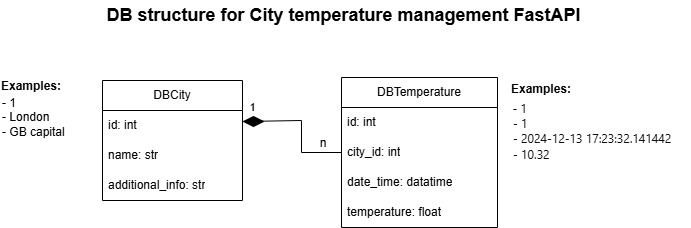
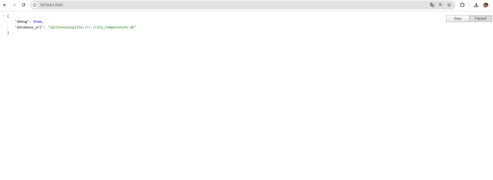
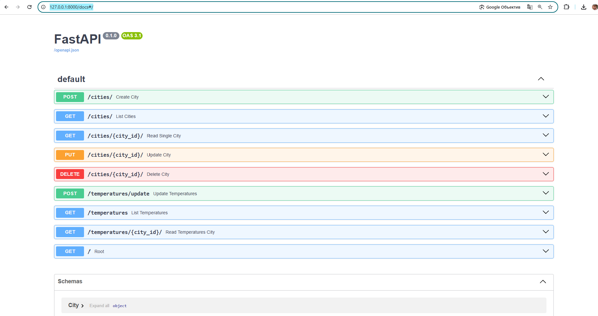

"# city_temperature_management_FastAPI"

FastAPI async application manages city data and their corresponding temperature data,
is using an online resource https://openweathermap.org/ with real-time information.
Current application realize a concurrency cooperative asyncio approach for IO-Bound tasks. 
The structure of database you can see: 



## Installing / Getting started

Python3 must be already installed
Docker must be already installed and running

```shell
git clone https://github.com/Anton-Konyk/py-fastapi-city-temperature-management-api.git
cd py-fastapi-city-temperature-management-api

for MacOS/Linux:
python3 -m venv venv
source venv/bin/activate 

or for Windows:
python -m venv venv
venv\Scripts\activate

pip install -r requirenents.txt
create .env file (see example: [example.env](example.env) )
alembic upgrade head # apply migrations to create your database 
http://127.0.0.1:8000  # check to start 
# you will see "debug": your_parameter (True or False),
# "database_url": "sqlite+aiosqlite:///./your_name.db" 
http://127.0.0.1:8000/docs#/  # API documentation


```

## Features

* Create a new city
* Get a list of all cities
* Get the details of a specific city
* Delete a specific city
* Fetches the current temperature for all cities in the database from an online resource OpenWeather
* Store this data in the Temperature table
* Get a list of all temperature records
* Get the temperature records for a specific city


## Contributing

It's open source code.
If you'd like to contribute, please fork the repository and use a feature
branch. 
Pull requests are warmly welcome.


## Demo


